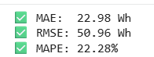
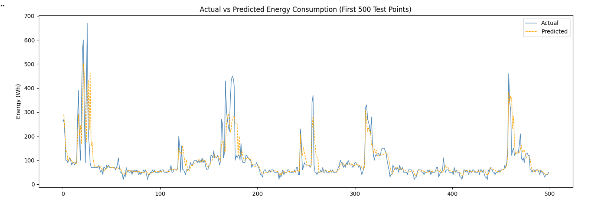
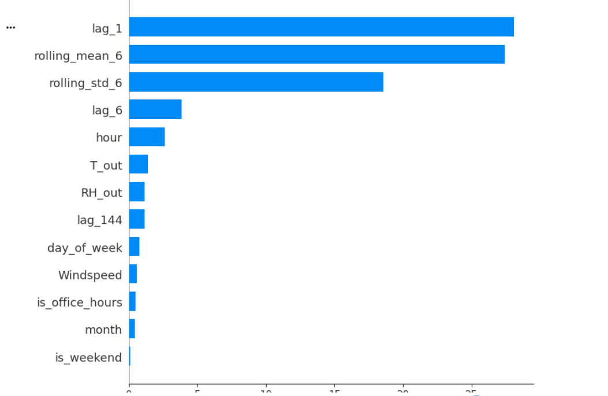

# ⚡ Office Energy Consumption Forecasting Dashboard


[](https://office-energy-forecasting-dashboard-byb9cixihrwm3c779d3hpv.streamlit.app/)

> Predict office energy consumption and calculate real-time CO₂ savings —  
> built for CleanTech and smart building applications.

## 🌐 Live Demo
👉 **[Click here to try the app](https://office-energy-forecasting-dashboard-byb9cixihrwm3c779d3hpv.streamlit.app/)**

---

## 🌍 Problem Statement

Energy waste in office buildings is one of the most overlooked contributors 
to CO₂ emissions. Most buildings have no intelligent system to forecast 
consumption, detect waste outside office hours, or estimate savings from 
efficiency improvements.

This dashboard solves that — instantly.

---

## 🎯 What This App Does

Input current building and weather conditions → get:
- ⚡ Predicted energy consumption (Wh)
- 🌿 CO₂ emitted (kg)
- 💡 Monthly CO₂ savings if consumption is reduced by X%
- ⚠️ Alerts for energy waste outside office hours

---

## 📸 Results

### 📊 Model Performance


| Metric | Value |
|---|---|
| **MAE** | 22.98 Wh |
| **RMSE** | 50.96 Wh |
| **MAPE** | 22.28% |

---

### 📈 Actual vs Predicted Energy Consumption


The model closely tracks real consumption patterns including peak 
usage spikes and overnight low-consumption periods.

---

### 🧠 SHAP Feature Importance


**Key insight:** Recent consumption (`lag_1`, `rolling_mean_6`) 
dominates predictions — confirming that energy usage follows strong 
short-term momentum patterns. External weather (`T_out`, `RH_out`) 
and time-of-day (`hour`) are secondary but meaningful signals.

---

## ⚙️ Feature Engineering

| Feature | Type | Meaning |
|---|---|---|
| `lag_1` | Lag | Consumption 10 minutes ago |
| `lag_6` | Lag | Consumption 1 hour ago |
| `lag_144` | Lag | Consumption 24 hours ago |
| `rolling_mean_6` | Rolling | Average consumption last hour |
| `rolling_std_6` | Rolling | Volatility of last hour |
| `hour` | Time | Hour of day (0–23) |
| `is_office_hours` | Time | 1 if between 8am–6pm |
| `is_weekend` | Time | 1 if Saturday or Sunday |
| `T_out` | Weather | Outside temperature (°C) |
| `RH_out` | Weather | Outside humidity (%) |
| `Windspeed` | Weather | Wind speed (m/s) |

---

## 🤖 Model Pipeline
Raw Data → Feature Engineering → Time-Based Train/Test Split (80/20)
→ Optuna Hyperparameter Tuning (50 trials)
→ XGBoost (Best Parameters)
→ Evaluation (MAE / RMSE / MAPE)
→ Streamlit Deployment


### Hyperparameters Tuned via Optuna

| Parameter | Search Range |
|---|---|
| `n_estimators` | 100 – 400 |
| `max_depth` | 3 – 10 |
| `learning_rate` | 0.01 – 0.3 |
| `subsample` | 0.6 – 1.0 |
| `colsample_bytree` | 0.6 – 1.0 |

> ⚠️ Note: Time-series data requires a **sequential train/test split**  
> (no shuffling) to prevent data leakage.

---

## 🛠️ Tech Stack

| Tool | Purpose |
|---|---|
| `Python` | Core language |
| `XGBoost` | Primary ML model |
| `Optuna` | Hyperparameter optimisation |
| `SHAP` | Feature explainability |
| `Scikit-learn` | Evaluation metrics |
| `Streamlit` | Interactive web dashboard |
| `Pandas / NumPy` | Data manipulation |
| `Matplotlib / Seaborn` | Visualisation |

---

## 🚀 Try It

**🌐 Live App:** [Click here](https://office-energy-forecasting-dashboard-byb9cixihrwm3c779d3hpv.streamlit.app/)

Or run locally:
```bash
git clone https://github.com/gauravbhatia-bit/office-energy-forecasting-dashboard.git
cd office-energy-forecasting-dashboard
pip install -r requirements.txt
streamlit run app.py
```

---

## 📁 Project Structure
📁 office-energy-forecasting-dashboard/
├── app.py
├── energy_model.pkl
├── requirements.txt
├── notebooks/
│ └── office_energy_forecasting.ipynb
└── screenshots/
├── model_metrics.png
├── actual_vs_predicted.png
└── shap_feature_importance.png


---

## 💡 Key Insights

- **Short-term memory dominates** — the last 10 minutes of consumption 
  (`lag_1`) is by far the strongest predictor
- **Time of day matters** — `hour` is the 5th most important feature, 
  confirming office usage patterns are highly time-dependent
- **Weather has moderate impact** — `T_out` and `RH_out` influence 
  consumption but are secondary to recent usage history
- **Weekends show significantly lower** consumption — `is_weekend` 
  captures this behavioural pattern

---

## 🌱 Why I Built This

Energy waste in offices is largely invisible — no alerts, no forecasts, 
no actionable insights. This project shows how ML can make that waste 
visible, quantifiable, and actionable.

As someone transitioning from civil engineering into data science, 
I built this to contribute to the energy transition using skills 
that bridge both worlds.

---

## 👤 Author

**Gaurav Bhatia**  
MSc Data Science, AI & Digital Business — GISMA University, Berlin  
📧 [gauravbhatia.gb6@gmail.com](mailto:gauravbhatia.gb6@gmail.com)  
🔗 [LinkedIn](https://www.linkedin.com/in/gaurav-bhatia-5a5a83184/) | [GitHub](https://github.com/gauravbhatia-bit)
